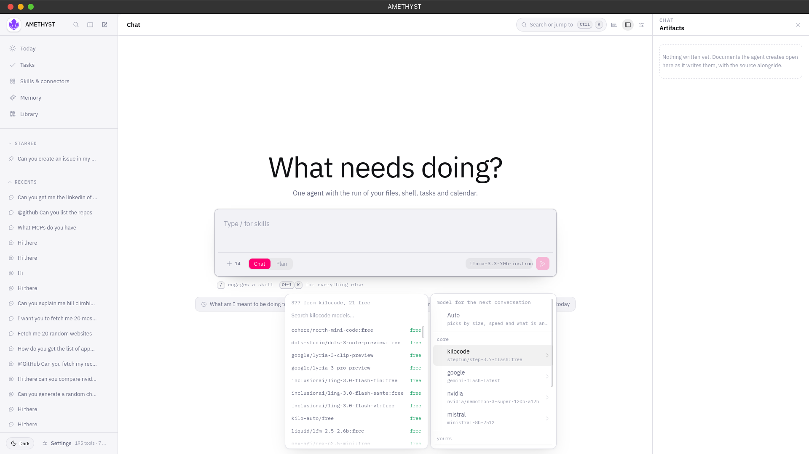
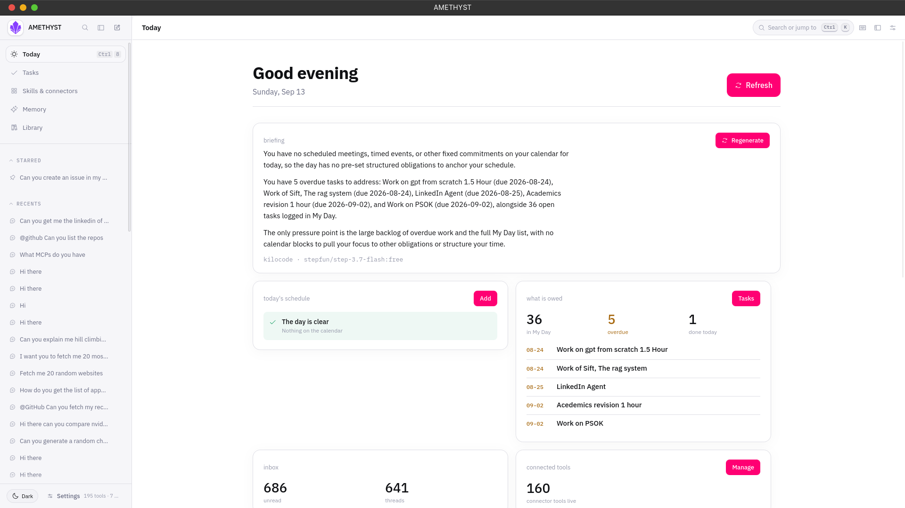
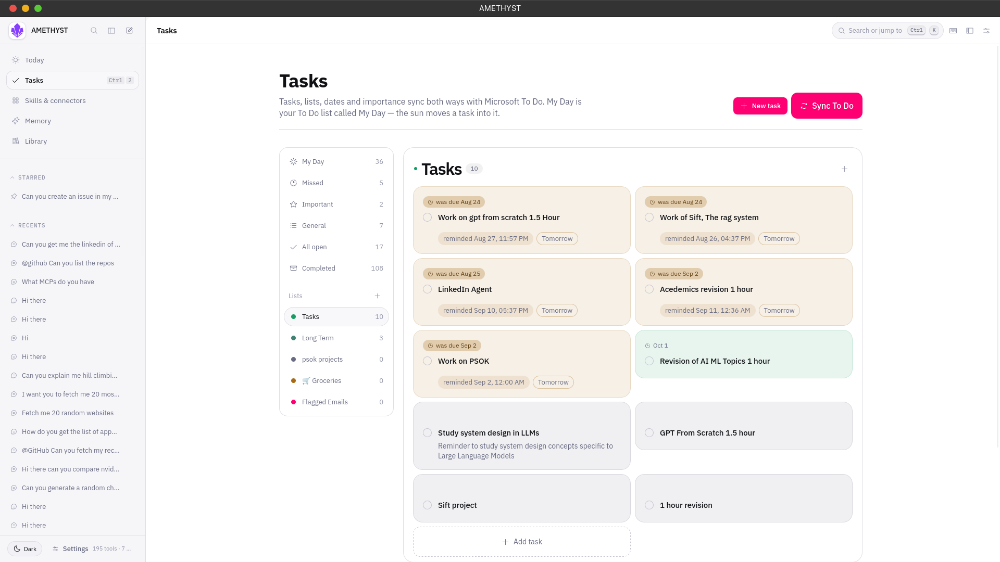
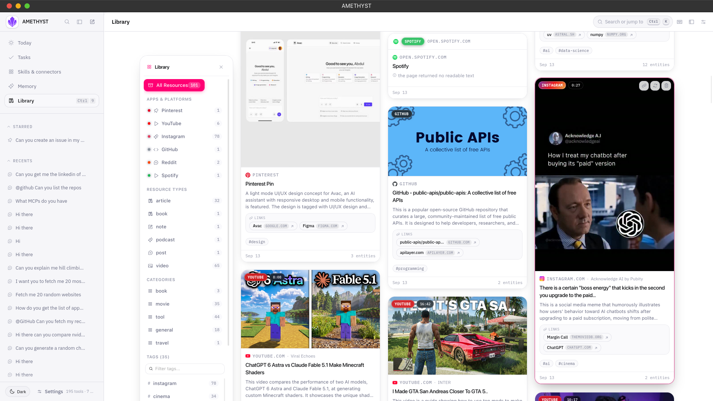
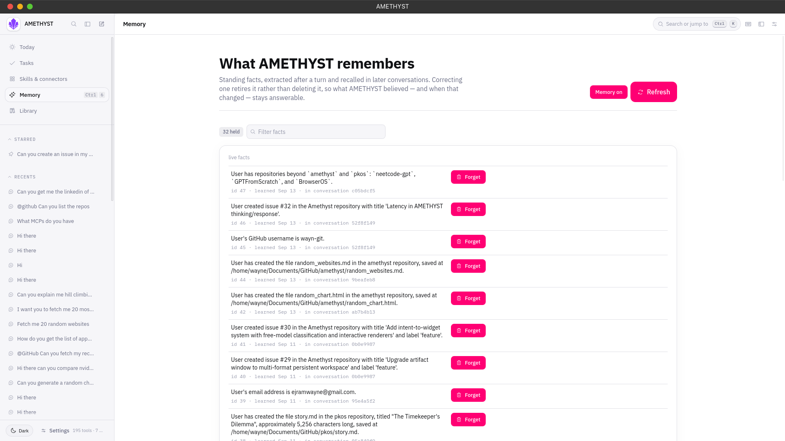
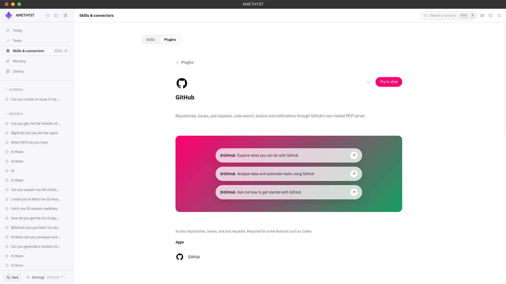
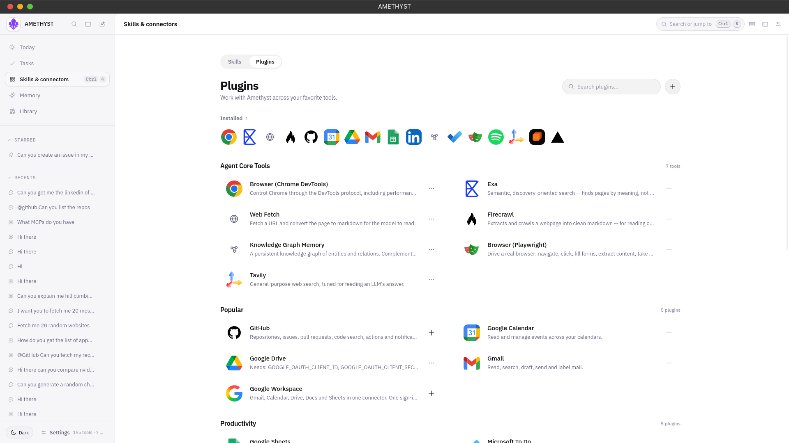
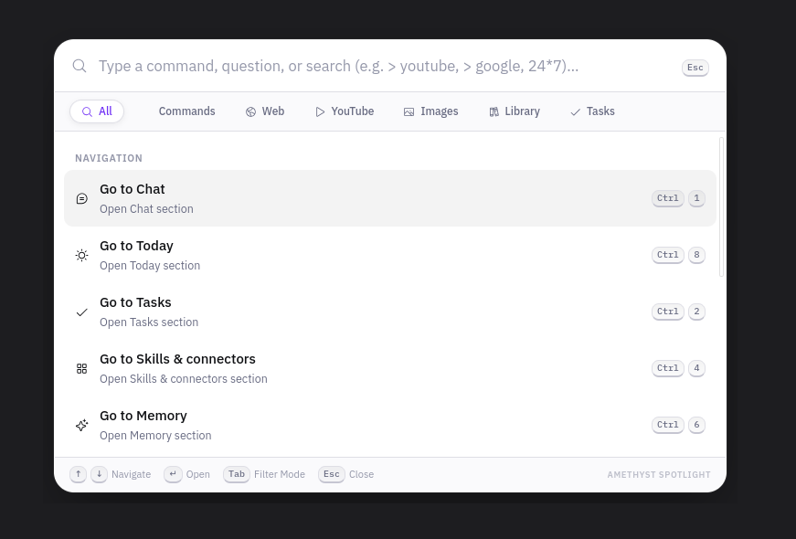
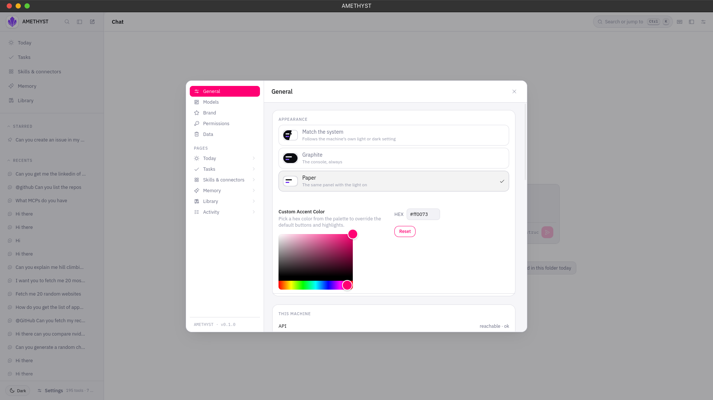

<div align="center">



# Amethyst

**One AI interface to your apps, information, tasks and tools.**

A local-first personal operating system. One FastAPI backend, one React
frontend, one SQLite database — everything stays on your machine.

`Python 3.11+` · `FastAPI` · `React 19` · `SQLite` · `MIT`

</div>

---

Amethyst runs an agent loop that reasons, acts, and observes — streaming every
turn, tracing every tool call, and asking before anything writes or runs. It
connects to your calendar, mail, tasks, and files; keeps a searchable Library of
everything you save; and works with local models through Ollama for a zero-cost,
zero-cloud setup, or with 20+ cloud providers.

## Features

| | |
|:---|:---|
|  | **Main** — the chat interface with live agent turns, streaming responses and tool traces |
|  | **Today** — the whole day on one page: morning briefing, events, what is owed |
|  | **Tasks** — lists and buckets on a board of cards, with a calendar engine that finds free slots and flags conflicts |
|  | **Library** — your knowledge vault: tags, grid or list, ask-chat over anything you saved, stored as plain markdown on disk |
|  | **Memory** — per-conversation extracted memories that persist context across sessions |
|  | **Plugin Overview** — a birds-eye view of all installed connectors and their status |
|  | **Skills & connectors** — Microsoft To Do, Google Workspace, GitHub, Spotify, and more, installed from one page |
|  | **Keyboard-first UI** — command palette (`⌘K`), full shortcut reference on `?`, no mouse required |
|  | **Settings** — manage providers, permissions, standing approvals, and preferences |
|  | **Live turn trace** — every tool call and argument streams as it happens, so you always know what the agent is doing |

Also: Mail (beta, direct Gmail), Automations (beta, a prompt on an interval), a full Activity log, and a tray + global hotkey desktop mode.

## The agent, briefly

- **Reason → act → observe.** The Director picks the tools; you watch it work.
- **Operation-level permissions.** A prompt names the exact operation —
  `write_file`, `run_shell_command:read-only` vs. destructive — and approving a
  read never approves a write. Standing approvals can be revoked anytime in
  Settings.
- **Skills are markdown.** A skill is a plain `SKILL.md` file. No plugins, no
  code lifecycle. Write one in the app, import a link, or install from the
  catalogue.
- **MCP connectors.** Any Model Context Protocol server — stdio, SSE, or
  streamable HTTP — registers into one flat tool registry.

## Quick start

**Fastest path** (macOS / Linux / WSL2 — Windows: `run.bat`):

```bash
git clone https://github.com/Wayn-Git/Amethyst.git
cd Amethyst
./run.sh
```

The script sets up the venv, installs dependencies, initializes the database,
builds the frontend, and opens **http://127.0.0.1:8000**.

**Docker:**

```bash
docker compose up
```

**Models in two minutes, no API keys:**

```bash
# Install Ollama from https://ollama.ai, then:
ollama run llama3.2
```

Ollama models appear in the chat model selector automatically. Prefer cloud?
Add a key to `.env` (`ANTHROPIC_API_KEY`, `OPENAI_API_KEY`, `GROQ_API_KEY`, …)
or run `./run.sh --setup` for the interactive wizard. See the
[Quickstart](QUICKSTART.md) for the full guide, including OAuth connectors and
the Cloudflare relay.

## Models

Works with local Ollama out of the box, plus 21 provider presets: OpenAI,
Anthropic, Google Gemini, Groq, OpenRouter, xAI, DeepSeek, Mistral, and more —
or point `providers.yaml` at any OpenAI-compatible endpoint.

## Security

- Every tool dispatch passes a permission gate; you approve the *operation*,
  not just the tool.
- Secrets live in the OS keychain, never in the database.
- State is a local SQLite database (WAL mode); Library files are plain
  markdown in `~/.amethyst/library/`.
- Shell tools run sandboxed; the sandbox and permission system are covered by
  the test suite.

## Documentation

| Doc | What it covers |
|---|---|
| [QUICKSTART.md](QUICKSTART.md) | 2-minute start, setup wizard, Ollama, FAQ |
| [docs/CONFIGURATION_GUIDE.md](docs/CONFIGURATION_GUIDE.md) | Every integration: providers, OAuth, Cloudflare relay, Library capture |
| [docs/interface.md](docs/interface.md) | The web UI: views, keyboard bindings, design rationale |
| [docs/deployment.md](docs/deployment.md) | Local single-process vs. Vercel + Render split deploy |
| [docs/architecture/overview.md](docs/architecture/overview.md) | Layer diagram, request lifecycle, design principles, ADRs |
| [CONTRIBUTING.md](CONTRIBUTING.md) | Setup, conventions, rules of the codebase |

## Project layout

```
backend/     FastAPI app, agent loop, tools, connectors, CLI
frontend/    React 19 + Vite SPA (chat, today, tasks, library, …)
relay/       Cloudflare Worker: holds Instagram/webhook captures while
             your machine sleeps
agents/      Bundled skills (plain SKILL.md files)
docs/        Guides, architecture notes, screenshots
tests/       53 pytest files — permissions, sandbox, retrieval, streaming
```

## Contributing

PRs welcome. Read [CONTRIBUTING.md](CONTRIBUTING.md) first — it documents the
conventions (one worker, secrets rule, comment philosophy) the codebase holds.

## License

[MIT](LICENSE)
